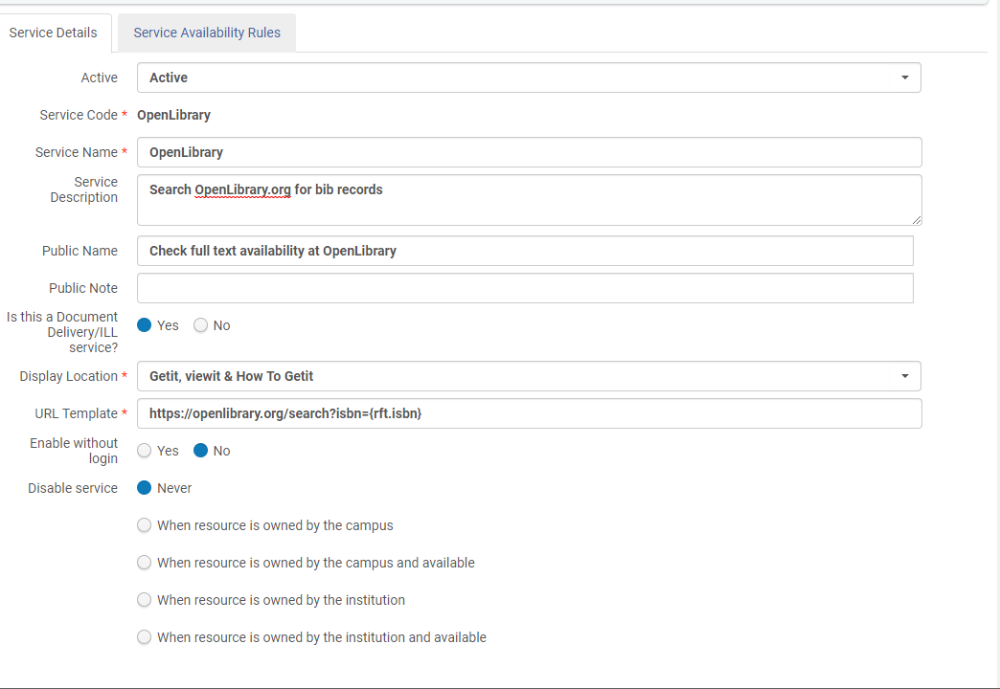
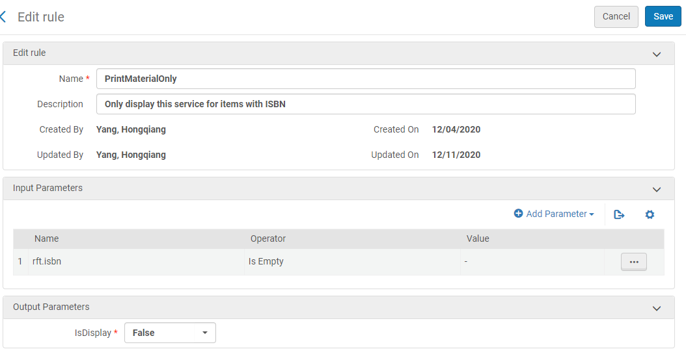
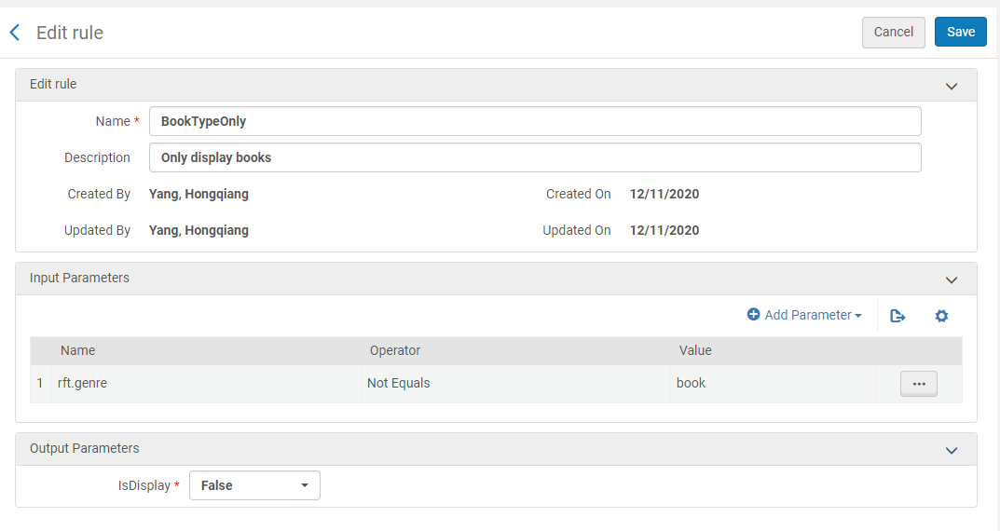
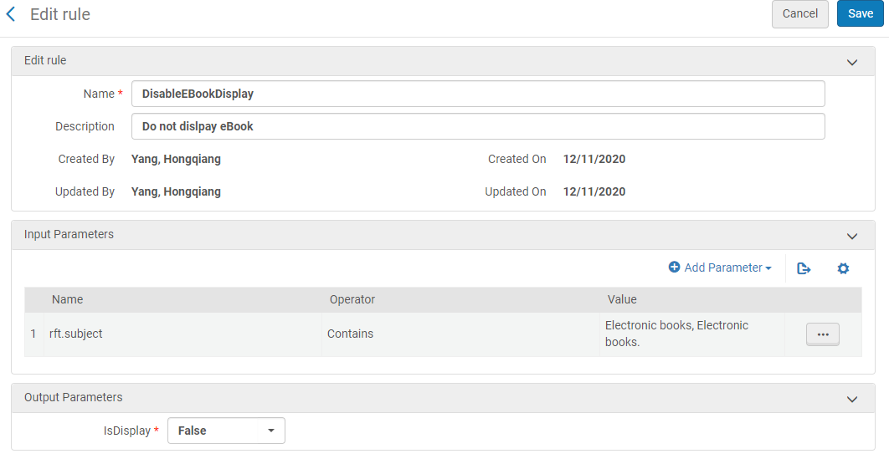
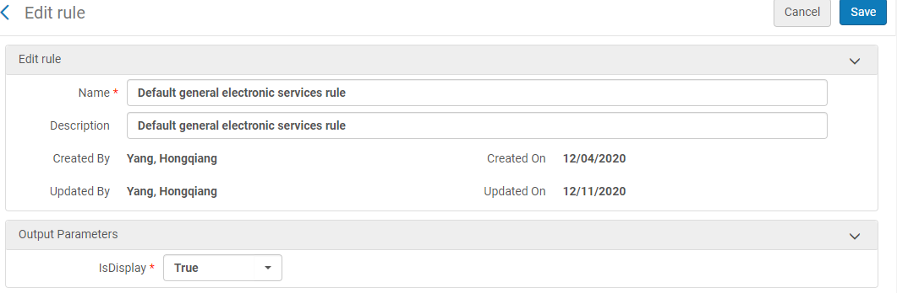

# hide-unavailable-open-library
The included custom.js file includes code to check the Open Library API and find out whether the currently displayed ISBN in Primo is borrowable from [Open Library](https://www.openlibary.org).

If a General Electronic Service (GES) for displaying links to Open Library has been set up in Alma's Fulfillment configuration (as outlined below), the custom.js will hide the GES link if the item is not borrowable from Open Library.

## Setting up the Open Library GES

1. Log into Alma with an administrator account,
1. Under Alma Configuration/Fulfillment/Discovery Interface Display Logic/General Electronic Services, click on “Add Service”,
1. Fill in the popup window with the information below:
    1. Service Code: `OpenLibrary`
    1. Service Name: `Open Library`
    1. Service Description: give a short description about this service, for example: `Search OpenLibrary.org for bib records and display a link to the open library catalog when available`.
    1. Public Name: this is the language/label that will show to the public users. Please fill in what your institution would like your users to see, for example: “`Check full text availability at OpenLibrary`.”
    1. Public Note: leave it blank or fill in detailed information for the public.
    1. Is this a Document Delivery/ILL service?: Choose “Yes”
    1. URL template: `https://openlibrary.org/search?isbn={rft.isbn}`
1. Click “Add and Close” to add this service,

1. Now you should see this as a new service under General Electronic Services. Click on “Edit” of the service you just created, you should see something like this screenshot:Please adjust the configuration options according to the screenshot above or make adjustments to meet your institution's needs. We selected the “`Getit, viewit & How to Getit`” option to enable the Open Library links to display in those three different situations, but you might want to change that to fit your own needs.
1. Click on “Service Availability Rules”, we added three rules to prevent the link to display whenever not needed. You might want to add more or revise those rules according to your own needs. The three rules are:
   1. PrintMaterialOnly:
      1. Input Parameters:
         1. Name: `rft.isbn`
         1. Operator: `Is Empty`
      1. Output Parameters:
         1. IsDisplay: `False`
   1. BookTypeOnly:
      1. Input Parameters:
         1. Name: `rft.genre`
         1. Operator: `Not Equals`
         1. Value: `book`
      1. Output Parameters:
         1. IsDisplay: `False`
   1. DisableEBookDisplay:
      1. Input Parameters:
         1. Name: `rft.subject`
         1. Operator: `Contains`
         1. Value: `Electronic books, Electronic books.`
      1. Output Parameters:
         1. IsDisplay: `False`
1. Next, edit the Default Rule for this service:
   1. Output Parameters:
      1. IsDisplay: `True`
1. Check on the General Services page to make sure it is “Active”. Then you should be able to see the OpenLibrary Link in Primo records for all print books with ISBNs. 

## Adding the custom.js code to your Primo view

If you do not have any custom javascript in your library's customization package for Primo, simply replace the default custom.js file included in your view (`[your Primo Dev Env root]/views/[your custom view folder]/js/custom.js`) with the one included in this repository.

If you already have some customized javascript code in your view's customization package, you will need to first check whether any of the following AngularJS/Primo directives are already being used as components in your custom code:

1. `prmRequestServicesAfter`
1. `almaHowovpAfter`
1. `prmAlmaViewitItemsAfter`

If none of those directives are used as components in your existing custom.js, you can simply paste lines 16 ("`/* Create reusable function for checking ISBNs */`") through 178 (the "`})`" just before the closing "`})();`") at the end of your custom.js, right before the file's final "`})();`."

If ANY of the above directives is already being used as a component in your custom.js, you will need to incorporate the controller code used for that component in this repo into the existing controller code for that component in your custom.js because AngularJS does not allow a directive to be used as a component more than once (i.e, by multiple controllers). Some understanding of AngularJS coding is necessary to incorporate the code into your own existing custom.js.